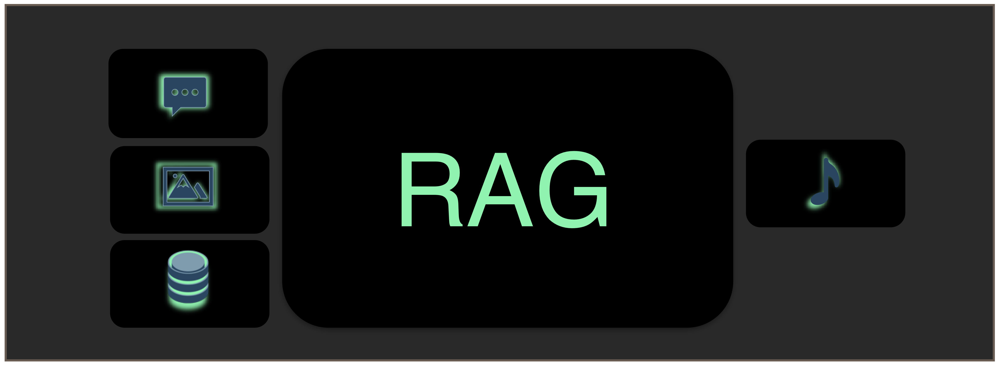
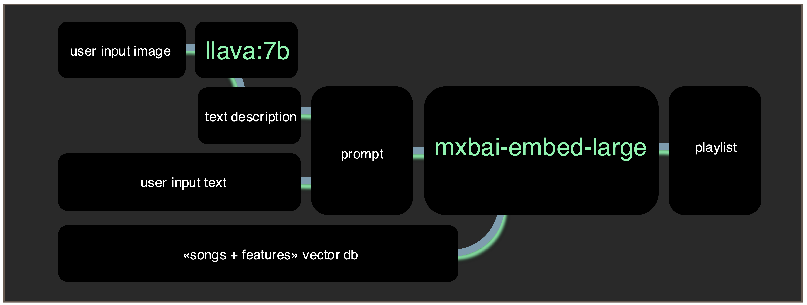

# PlaylistRAGulator



## About
**PlaylistRAGulator** is a RAG AI app that matches your vibe. Drop in some text or an image, and it’ll curate a playlist that perfectly fits the mood. Effortless music discovery, one vibe at a time.

## Local Execution
**PlaylistRAGulator** is fully containerized using Docker, ensuring a seamless setup with minimal effort. All models run locally through **Ollama**, providing a secure and efficient environment. Once the Docker container is built, no additional installation is required—everything you need is bundled inside the container.

## How to Use

### 1. Docker Setup
- Navigate to the `dockerfile` folder and build the Docker image:
  ```bash
  docker build -t playlistragulator .
  ```

### 2. Download Models
- Run the following command to download the required models:
  ```bash
  docker run --rm \
    -v /path/to/PlaylistRAGulator/ollama_models:/root/.ollama/models \
    -v /path/to/PlaylistRAGulator:/home \
    playlistragulator bash pull_models.sh
  ```

### 3. Generate Playlist
- Unzip the database:
  ```bash
  unzip data/chroma_db.zip
  ```
- Run the playlist generator:
  ```bash
  docker run --rm \
    -v /path/to/PlaylistRAGulator/ollama_models:/root/.ollama/models \
    -v /path/to/PlaylistRAGulator:/home \
    playlistragulator bash make_playlist.sh
  ```

## Input & Output

### Input

The inputs can be found in the folder `data/user_inputs`.
- **Text Prompt:** A description of the desired mood, vibe, or theme (e.g., "Chill sunset vibes" or "Energetic workout beats").
- **Image:** Upload an image that represents the mood or location you want to capture in the playlist.
- **Configuration File:** Located at `data/user_inputs/config.json`, this file controls model selection, file paths, and generation settings.

### Config File Explanation
- **`embedmodel`**: Name of the embedding model used for text analysis (e.g., "mxbai-embed-large").
- **`vismodel`**: Visual model used to analyze images (e.g., "llava:7b").
- **`chroma_db_path`**: Path to the Chroma database used for song embeddings.
- **`nb_songs`**: Number of songs to include in the generated playlist.
- **`dataset_in_path`**: Path to the input dataset containing music metadata.
- **`use_img`**: Boolean flag to enable or disable image input (`true` to use images).
- **`img_path`**: Path to the input image for mood detection.
- **`img_small_path`**: Path to the resized version of the input image.
- **`img_w`**: Width of the resized image.
- **`img_h`**: Height of the resized image.
- **`img_desc_path`**: Path to the generated image description text file.
- **`use_adj`**: Boolean flag to use additional adjectives for mood enhancement.
- **`adj_path`**: Path to a CSV file containing mood adjectives.
- **`output_path`**: Path where the generated playlist will be saved.
- **`nb_row_embed`**: Number of rows to embed from the dataset for analysis.
- **`songs_path`**: Path to the CSV file containing song metadata.
- **`features_path`**: Path to the CSV file containing acoustic features of songs.

### Output
- **Curated Playlist:** A playlist of songs tailored to match the mood or theme based on the input.
- **Playlist File:** The playlist is saved as `data/outputs/playlist.csv`, where each row represents a selected song.
- **Processed Image & Description:** In `data/outputs/inter/`, you will find the resized input image and the text description generated by the model.
- **File Format:** The playlist can be output as a CSV file, a text file with song titles.


## How It Works



1. **Image Analysis:** If an image is provided, it is processed by the vision model (`llava:7b`) to generate a descriptive text that captures the atmosphere and mood.
2. **Prompt Generation:** This description is combined with a user-provided list of adjectives (from `data/user_inputs/adjectives.csv`) to create a detailed prompt.
3. **Music Matching:** The prompt is used to query the vector database (`data/chroma_db`) that contains embeddings of songs, selecting tracks that best match the mood.

Here you can find an example how the data flows into the pipeline.


---
Enjoy discovering music that matches your vibe with **PlaylistRAGulator**! 🎶
